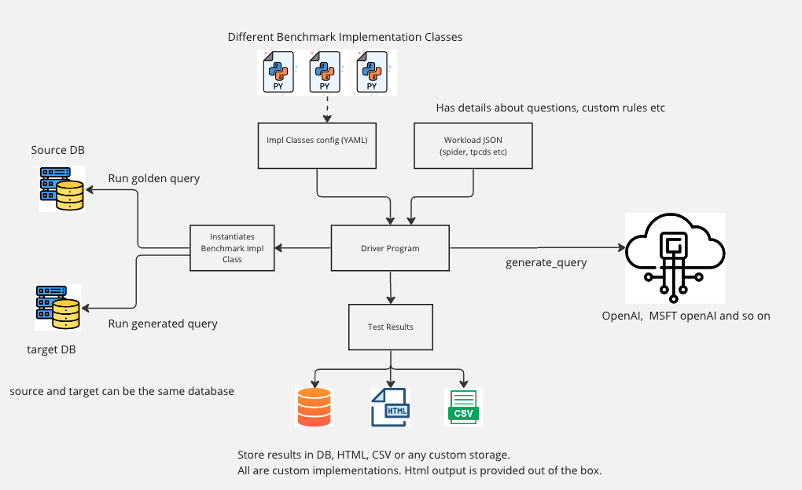
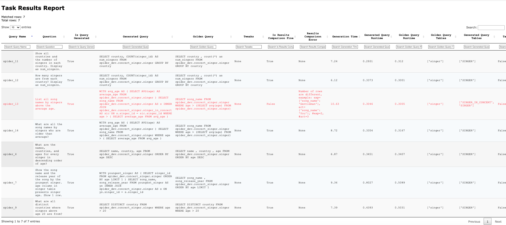

# Benchmark

This is a benchmarking framework designed for evaluating the capabilities of NL2SQL systems. It was introduced in the CIDR paper (<TBD link>).

The benchmark originated in a collaboration between Microsoft and Waii. Contributions and additions are welcome.



# Benchmark Details
- Driver program reads the benchmark config and workload config and runs the benchmark.
- Benchmark config contains details about the benchmark, such as benchmark name, database connection details, etc.
- Workload config contains details about the workload, such as queries to run, etc.
- Base benchmark is responsible for running all the text-to-sql queries in multithreaded fashion.
- Each benchmark should extend the BaseBenchmark class and override the methods as needed. 
- Responsibility of the child benchmarks is to ensure that they provide a valid SQL after invoking relevant LLM. Base benchmark
takes care of running the query in golden database and compare the results.

# Benchmark Result Comparison
In the interest of stability, result comparisons follow certain rule
- Results of golden query and LLM query result can be in any order. Result comparison will take care of this.
- Results are compared in case-insensitive manner.
- Compare all columns or few of the columns. This is configurable in workload config YAML file.
- Duplicates are ignored, focusing on validating the query's uniqueness and usefulness.
- Round off float to round(float,0) for comparison.

# Prerequisites
Ensure you have python3 and git installed.

# Setup
Clone the repository and navigate to the benchmark directory: 
```
gh repo clone waii-abi/benchmark
cd benchmark
```

# Benchmark Config
Edit `benchmark_config.yaml` file in resources/config folder. 

This file should include specific configuration details for each benchmark, such as 
* any endpoints for the benchmark
* source and target database connection information, etc. 

E.g. WaiiBenchmark contains details about its endpoint for generating text-to-sql, database connection details and so on.
This will be used by WaiiBenchmark for running the queries.

For other LLM integrations, extend the BenchmarkBase class from base_benchmark.py and override methods the following methods as needed.
* setup
* generate_query
* cleanup
BaseBenchmark contains most of the code to run the benchmark, in multithreaded fashion.

Details about source and target databases are mentioned in the benchmark config file. 
In certain benchmarks, source and target databases can be the same. In such cases, you can use "same_as_source=true" in target database in config.
Generated SQL will be run in the target database and results will be compared with the golden query results (run on source database).

# Workload Config
Workload-specific configurations are located in the resource/workloads directory. 
For instance, configurations for the Spider workload can be found in the spider.yaml file.

# Running the benchmark
```
cd benchmark/bin

./run_benchmark.sh --help

Usage: ./run_benchmark.sh [options]

   -r, --run_queries         Specify which queries to run, e.g. spider_12,spider_13
   -b, --benchmark_config    Path to benchmark config
   -n, --benchmark_name      Name of benchmark
   -w, --workload_config     Path to workload config
   -i, --run_id              Run ID for the benchmark
   -h, --help                Display help message

# For llama-index benchmark
./run_benchmark.sh -b ../resources/config/benchmark_config.yaml -n LlamaIndexBenchmark -w ../resources/workloads/llama_index_workload.yaml -i test_llama_index

# For Waii benchmark
./run_benchmark.sh -b ../resources/config/benchmark_config.yaml -n WaiiBenchmark -w ../resources/workloads/spider_workload.yaml -i waii_benchmark

```

This should generate a report at the end of the run. You can also check the logs in the logs directory.

# Benchmark Report & Metrics
The benchmark generates a report at the end of the run. Though success ratio of the queries is important, there are other details that will be valuable to evaluate the benchmark.

The report contains the following details:
* Details on whether system was able to generate the query for the question.
* Details on results comparison. Details on rules are covered earlier in this document.
* Details on the queries that were run including generated query and golden query.
* Time taken to generate the query.
* Time taken to run the generated query and golden query.
* Details on whether generated and golden query were accessing same tables or not.


**Sample Runs:**


<br>



<br>


# Workload Configuration Format

To include your workload, please adhere to the following YAML format. 
Each query is identified by a unique key (e.g., spider_1) and contains several parameters that define the query, its rules for comparison, and related schema information.

```yaml
spider_1:
  query_name: spider_1
  question: How many singers do we have? Display as num_singers.
  golden_query: SELECT count(*) as num_singers FROM spider_dev.concert_singer.singer
  tables:
  - singer
  comparison_rules:
  - columns:
    - num_singers
    match: exact
  auto_select_schema: 'false'
  schemas:
  - concert_singer
```

* query_name: A unique identifier for your query. It should be descriptive and concise.
* question: Question that needs to be converted from text-to-SQL.
* tables: Identifies tables involved in the query; Used for subsequent comparison of chosen tables in generated queries.
* comparison_rules: Defines the rules for comparing the results of your query with the golden query. Include the columns to be matched and the type of match. It can be "exact" or "oneof"
* columns: List the columns you wish to include in the comparison.
* match: Specify the match type (e.g., 'exact' for an exact match).
* golden_query: The SQL query that is considered as the 'golden' or reference standard for comparison.
* schemas: List the schemas that are involved in the query.
* auto_select_schema: Indicates whether the schema should be automatically selected. Set to 'true' or 'false'.

You can have one or more of these in the workload file. Please ensure your workload configuration adheres to this format.

# Additional options available
There are certain options available to customize the benchmark run. This is not directly exposed via run_benchmark.sh
These parameters can be added optionally to the python driver.

* --halt_on_error: Halt the benchmark if any error occurs.
* --include_filter: Run only the queries that match the filter.
* --exclude_filter: Run all queries except the ones that match the filter.

# Notes
* llama_index_workload.yaml was added as a sample workload and to show as demo. You can create/include your workload config for the benchmark.
* Demo data for llama_index is available in bin/world_1.sqlite. Provide entire path in benchmark_config.yaml to try this out.
* For Waii benchmark, contexts are automatically loaded as part of setup. This is not needed for other benchmarks.

# TroubleShooting
* Ensure to run the benchmark via shell script in benchmark/bin directory to avoid any module error. It setups the virtual environment needed for the benchmark.
* "Error during benchmark: (snowflake.connector.errors.ForbiddenError) 250001 (08001): None: Failed to connect to DB. Verify the account name is correct: <account>.snowflakecomputing.com:443. HTTP 403: Forbidden"
  * Ensure to verify database configuration in benchmark_config.yaml
